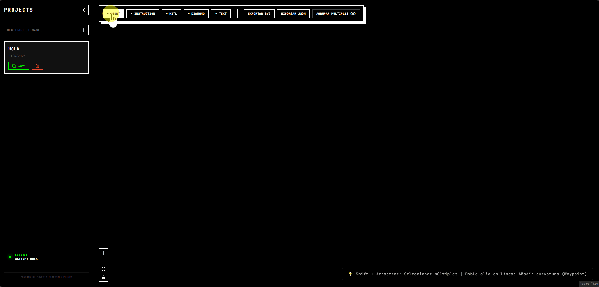

# 🤖 Agent BOB | SOVERIS

A professional, monotone visual orchestration tool for designing AI Agent workflows. Built by **SOVERIS** (formerly PHUNK), focusing on high-contrast aesthetics, universal port systems, and developer productivity.



## ✨ Features

- **SOVERIS Monotone Engine**: High-contrast black & white aesthetic for zero-distraction design.
- **Universal Port System**: Bi-directional handles for seamless flow orchestration.
- **Advanced Orchestration Logic:**
  - **Backdrop Grouping:** Select multiple nodes with a marquee and group them into parent components that automatically lock relative coordinates.
  - **Bézier Waypoints:** Double-click any flow edge to inject an invisible routing node, giving you immediate curved-line track control.
  - **Semantic Edge Reversal:** Click any edge to peacefully invert its visual logic (Blue/Red direction) without corrupting your spatial diagram structure.
- **Contextual Help Panel:** A dynamic, non-intrusive AI-styled glass panel that suggests keyboard shortcuts and actions based on your precise selection context.
- **Universal Port System:** Infinite dynamic connections overlapping perfectly without UI clutter.
- **High-Fidelity Export:** Export your architectures natively as production-ready SVG graphs or standard JSON Blueprints.
- **Persistence:** Local ZUSTAND cache engine ensures your complex workflows never wipe out on refresh.

## 🛠️ Stack

- **Framework**: React 18
- **Visual Engine**: [XYFlow / React Flow](https://reactflow.dev/)
- **State Management**: [Zustand](https://github.com/pmndrs/zustand)
- **Styling**: Vanilla CSS (SOVERIS Design System)
- **Icons**: [Lucide React](https://lucide.dev/)

## 🚀 Getting Started

1. **Clone the repo**
   ```bash
   git clone https://github.com/MauroBueno-soverix/agent_BOB.git
   cd agent_BOB
   ```

2. **Install dependencies**
   ```bash
   npm install
   ```

3. **Run development server**
   ```bash
   npm run dev
   ```

## 📂 Project Structure

- `src/components`: UI components with SOVERIS branding.
- `src/store`: Centralized state management with persistence.
- `openspec`: Evolution logs and assisted development history.

## 📜 License

Distributed under the MIT License. Copyright (c) 2026 SOVERIS.

---

*Built with ❤️ by SOVERIS.*
